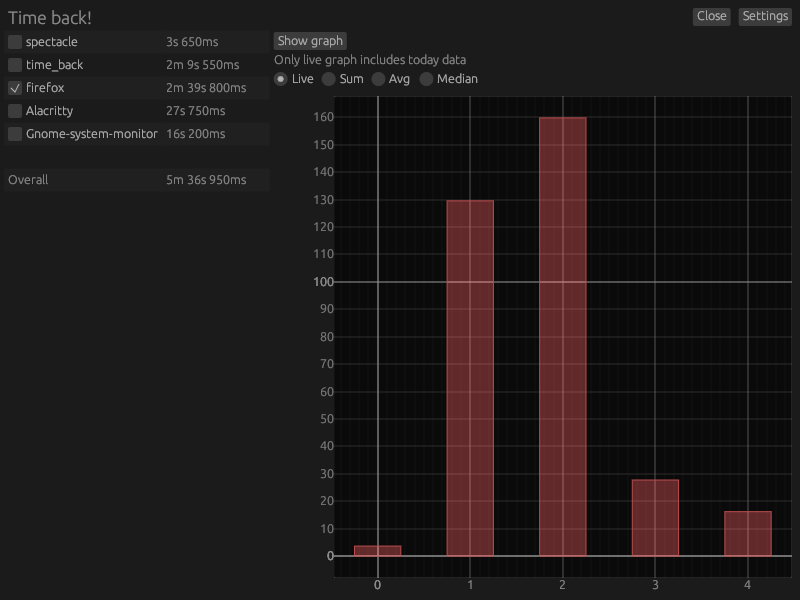

# Time back!
A practical utility designed to track your application usage, providing insightful analytics for enhanced productivity management.

## How to build it
To set up Time back!, execute the following command: `cargo build --release`.

## Usage
Upon launching Time back!, you'll be prompted to specify the directory for data collection. No additional configuration is required.

On the left-hand side of the interface, you'll find real-time data tracking. Optionally, the right-hand side displays a graph for visual analysis. Time back! accurately records the active window, pausing data collection during user inactivity to maintain precision. For continuous monitoring of specific applications, toggle the checkbox next to the application name—a setting preserved across sessions.

### Application close
To ensure seamless data capture, Time back! must remain active and can only be closed using the in-app button or manual process termination. This feature guarantees uninterrupted functionality, without the need of a system tray icon that is not universally supported.

